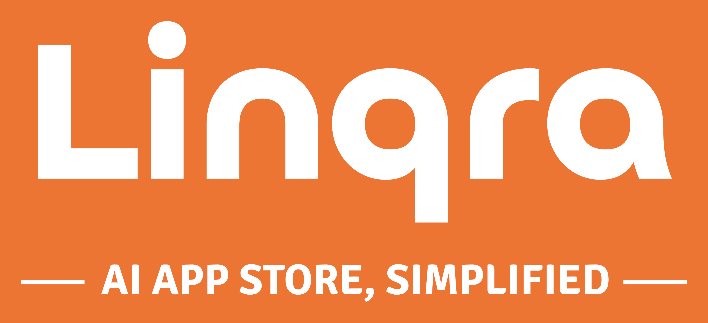

  

# What is Linqra?

<div align="center">
<a href="assets/linqrawithbg.png"> </a>
</div>
<br/>

Linqra introduces a new paradigm for AI deployment: an Enterprise AI App Store that lets organizations discover, deploy, and manage AI applications with unprecedented ease. Built on our battle-tested gateway infrastructure, it ensures enterprise-grade security, scalability, and reliability for all AI services. This unique combination allows companies to innovate with AI while maintaining the robust security and performance standards they expect from traditional enterprise software.

🌐 **[Visit Linqra.com](https://linqra.com)** for more information and live demos.

## Key Features

### 🏪 AI App Store
Discover and deploy AI applications with enterprise-grade security and management capabilities. Our curated marketplace ensures quality and compatibility while providing seamless integration options.

### 🔐 Enterprise Gateway
Built with a security-first approach, Linqra provides comprehensive authentication, rate limiting, and load balancing features that protect and optimize your API infrastructure.

### 📡 Linq Protocol
Our unified protocol simplifies how your applications communicate with AI services. Instead of managing multiple API formats, use one consistent approach for all AI interactions.

```json
{
  "link": {
    "target": "ai-workflow",
    "action": "create"
  },
  "query": {
    "intent": "workflow/execute",
    "payload": {
      "workflow": {
        "steps": [
          {
            "id": "analysis",
            "service": "chat-service",
            "action": "completion"
          }
        ]
      }
    }
  }
}
```

## Deployment Options

- **Enterprise On-Premise**: Full control over data and security
- **Private Cloud**: AWS, Azure, or GCP with Kubernetes support
- **Startup Quick-Start**: Docker Compose for rapid development

## Documentation

For detailed information about installation, configuration, and usage, visit our [comprehensive documentation](https://docs.linqra.com/introduction).

## License

Linqra is distributed under the **GNU Affero General Public License v3.0 (AGPL-3.0)**. For commercial use, please contact us at msen@dipme.app.

See the [LICENSE](./LICENSE) file for details.

## Support

- [Issue Tracker](https://github.com/mehmetsen80/Linqra/issues)
- [Documentation](https://docs.linqra.com/introduction)
- [Community Discussion](https://github.com/mehmetsen80/Linqra/discussions)
